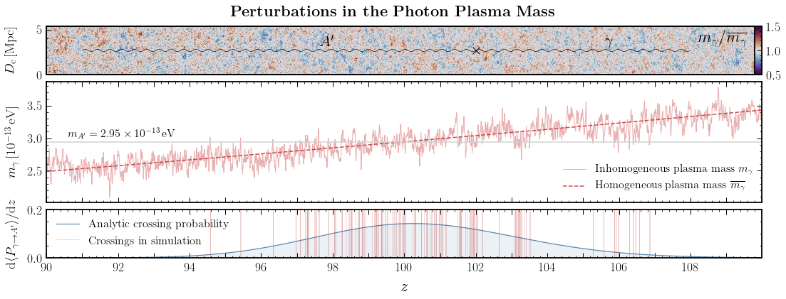
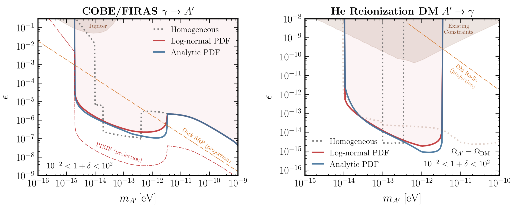

# Dark Photon Oscillations in Our Inhomogeneous Universe

Code repository for the paper
**Dark Photon Oscillations in Our Inhomogeneous Universe**
by Andrea Caputo, Hongwan Liu, Siddharth Mishra-Sharma, and Joshua T. Ruderman.

[](https://opensource.org/licenses/MIT)
[](./)
[](./)
[](https://arxiv.org/abs/2002.xxxxx)




## Abstract

A dark photon may kinetically mix with the ordinary photon, inducing oscillations with observable imprints on cosmology.  Oscillations are resonantly enhanced if the dark photon mass equals the ordinary photon plasma mass, which tracks the free electron number density.  Previous studies have assumed a homogeneous Universe; in this Letter, we introduce for the first time an analytic formalism for treating resonant oscillations in the presence of inhomogeneities of the photon plasma mass.  We apply our formalism to determine constraints from Cosmic Microwave Background photons oscillating into dark photons, and from heating of the primordial plasma due to dark photon dark matter converting into low-energy photons. Including the effect of inhomogeneities demonstrates that prior homogeneous constraints are not conservative, and simultaneously extends current experimental limits into a vast new parameter space.

## Main Results

The data points for the fiducial constraints presented in the paper are provided in [data/constraints](data/constraints), and a Jupyter notebook plotting these is provided in [10_fiducial_constraints.ipynb](notebooks/10_fiducial_constraints.ipynb).



## Code

The dependencies of the code are listed in [environments.yml](environment.yml).

The [notebooks](notebooks/) folder contains various Jupyter notebooks that reproduce the plots in the paper. Additionally, [00_dP_dz.ipynb](notebooks/00_dP_dz.ipynb) describes how to extract the differential conversion probability dP/dz for various scenarios and choices of the underlying matter distribution explored in the paper.

## Authors

-  Andrea Caputo; andrea dot caputo at uv dot es
-  Hongwan Liu; hongwanl at princeton dot edu
-  Siddharth Mishra-Sharma; sm8383 at nyu dot edu
-  Joshua T. Ruderman; ruderman at nyu dot edu

## References

If you use this code, please cite our paper:

```
@article{
    
}
```
